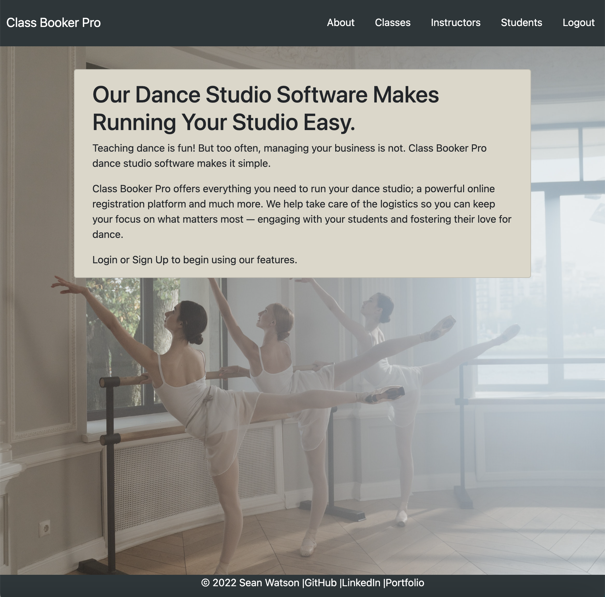

# Class Booker Pro

Teaching dance is fun! But too often, managing your business is not. Class Booker Pro dance studio software makes it simple.

Class Booker Pro offers everything you need to run your dance studio; a powerful online registration platform and much more. We help take care of the logistics so you can keep your focus on what matters most — engaging with your students and fostering their love for dance.

* As a User, you are able to create a class in the database and add/remove students and instructors to it from the class detail page.
* As a User you are able to create a student in the database and add/remove classes them from the detail page, as well as add a photo.
* As a User you are able to create an instructor in the database and add students and instructors to it from the detail page.

## Technologies Used

Python | Django | PostgreSQL | CSS3 | HTML5 | Bootstrap | AWS | Heroku

## Screnshots

## Getting Started

[Click Here](https://class-booker-pro.herokuapp.com/) to deploy the app!

## Future Enhancements

* tuition functionality / billing
* sequencing classes / students by selected criteria
* searchbar functionality

## Special Thanks
Photo courtesy of [cottonbro](https://www.pexels.com/@cottonbro/) 